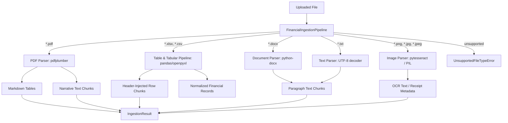

# Spec 01: Multimodal Financial Document Ingestion

## 1. Goal & Scope
Build the multimodal ingestion pipeline for financial documents, supporting both narrative context and structured data contracts for deterministic analytics and Power BI dashboards:
- **Supported File Types**:
  - `.pdf`: Financial statements, annual reports, 10-K filings, earnings transcripts.
  - `.xlsx` / `.csv`: Multi-sheet workbooks, balance sheets, P&L tables, sales registries.
  - `.docx`: Executive memos, strategy documents, accounting policy notes.
  - `.txt`: Raw text disclosures, audit notes.
  - `.png` / `.jpg` / `.jpeg`: Scanned invoices, receipts, and table snapshots.
- **Table Preservation & Dual-Path Tabular Processing**:
  - Extract tables from PDFs and spreadsheets, converting them into clean Markdown format.
  - Apply header-injected row serialization (`Store: {name} | Row: {idx} | Metric: {val} ...`) to ensure vector embeddings retain table context.
  - Extract normalized `FinancialRecord` objects for exact metric lookups and Cypher graph building.
- **Optical Character Recognition (OCR)**:
  - Run Tesseract OCR (`pytesseract`) on image uploads to extract itemized receipts and monetary values, with automatic fallback to image metadata (format, dimensions, mode).
- **Tenant & Document Provenance**:
  - Attach `store_id` and `doc_id` to every generated chunk and record to guarantee multi-tenant data isolation.

## 2. Target File Tree
- `src/ingestion/models.py`                  # Core Pydantic contracts (FinancialChunk, FinancialRecord, IngestionResult)
- `src/ingestion/parsers/pdf.py`             # Table-aware and narrative PDF parser using pdfplumber
- `src/ingestion/parsers/table.py`           # Multi-sheet Excel and CSV table parser
- `src/ingestion/parsers/document.py`        # Word (.docx) paragraph and plain text (.txt) parser
- `src/ingestion/parsers/image.py`           # Tesseract OCR image and receipt parser with metadata fallback
- `src/ingestion/parsers/tabular_pipeline.py` # Dual-path header-injected serialization and schema blueprinting
- `src/ingestion/pipeline.py`                # Unified FinancialIngestionPipeline orchestrator
- `tests/test_ingestion.py`                  # Comprehensive 8-test verification suite

## 3. Data Contracts & Interfaces
Use Pydantic v2:

```python
from typing import Any, Dict, List, Optional
from pydantic import BaseModel, Field

class FinancialRecord(BaseModel):
    metric: str
    period: str
    value: Optional[float]
    raw_value: str
    source_file: str
    sheet_name: Optional[str] = None
    store_id: Optional[str] = None
    doc_id: Optional[str] = None
    metadata: Dict[str, Any] = Field(default_factory=dict)

class FinancialChunk(BaseModel):
    chunk_id: str
    content: str  # Markdown text or Markdown table representation
    chunk_type: str  # "table", "text", or "receipt_metadata"
    source_file: str
    store_id: Optional[str] = None
    doc_id: Optional[str] = None
    source_type: Optional[str] = None
    metadata: Dict[str, Any] = Field(default_factory=dict)
    structured_records: List[FinancialRecord] = Field(default_factory=list)
    # metadata keys: page_number, sheet_name, fiscal_quarter, fiscal_year, row_index

class IngestionResult(BaseModel):
    source_file: str
    total_chunks: int
    chunks: List[FinancialChunk]
    store_id: Optional[str] = None
    doc_id: Optional[str] = None
```

## 4. Parser Architecture & Ingestion Flow



### 4.1. PDF Parser (`parsers/pdf.py`)
- Iterates over pages using `pdfplumber`.
- Extracts explicit tabular bounding boxes and formats them into pipe-delimited Markdown tables (`chunk_type="table"`).
- Extracts remaining page text as narrative chunks (`chunk_type="text"`).
- Preserves `page_number` and table sequence indexing in metadata.

### 4.2. Tabular Parser (`parsers/table.py` & `parsers/tabular_pipeline.py`)
- Ingests CSV and Excel files. Iterates over every worksheet in `.xlsx` independently.
- **Header-injected row serialization**: Formats each row into an explicit string:
  `Store: {store_name} | Row: {row_idx} | {Col1}: {Val1} | {Col2}: {Val2}`
- Generates `FinancialRecord` objects for each column-value pair where numerical values can be parsed (cleaning commas, currency signs, and percentages).

### 4.3. Document & Text Parser (`parsers/document.py`)
- `.docx`: Reads paragraphs, filters out empty or whitespace-only lines, and produces searchable text chunks preserving document hierarchy.
- `.txt`: Reads UTF-8 content and yields indexed narrative text chunks.

### 4.4. Image & Receipt OCR Parser (`parsers/image.py`)
- Uses `pytesseract.image_to_string` to extract text from receipts and scanned invoices.
- If OCR yields empty text or Tesseract binary is unavailable, gracefully falls back to image metadata (format, dimensions, color mode) under `chunk_type="receipt_metadata"`.

## 5. Verification & Acceptance Criteria
Verified by **8 passing tests** in `tests/test_ingestion.py`:
1. `test_csv_parsing_preserves_table_and_metadata`: Verifies CSV table structure and row metadata.
2. `test_excel_parsing_preserves_each_sheet_and_metadata`: Verifies multi-sheet extraction and sheet naming.
3. `test_text_parsing_creates_searchable_chunk`: Verifies UTF-8 text file parsing.
4. `test_docx_parsing_extracts_non_empty_paragraphs`: Verifies Word paragraph extraction.
5. `test_image_parsing_extracts_ocr_text`: Verifies OCR extraction with mocked/real pytesseract.
6. `test_invalid_extension_is_rejected`: Verifies `UnsupportedFileTypeError` on invalid file extensions.
7. `test_pdf_table_extraction_is_markdown_and_page_aware`: Verifies PDF table extraction into Markdown.
8. `test_pdf_extracts_both_tables_and_narrative_text`: Verifies dual extraction of both tables and narrative text from PDFs.