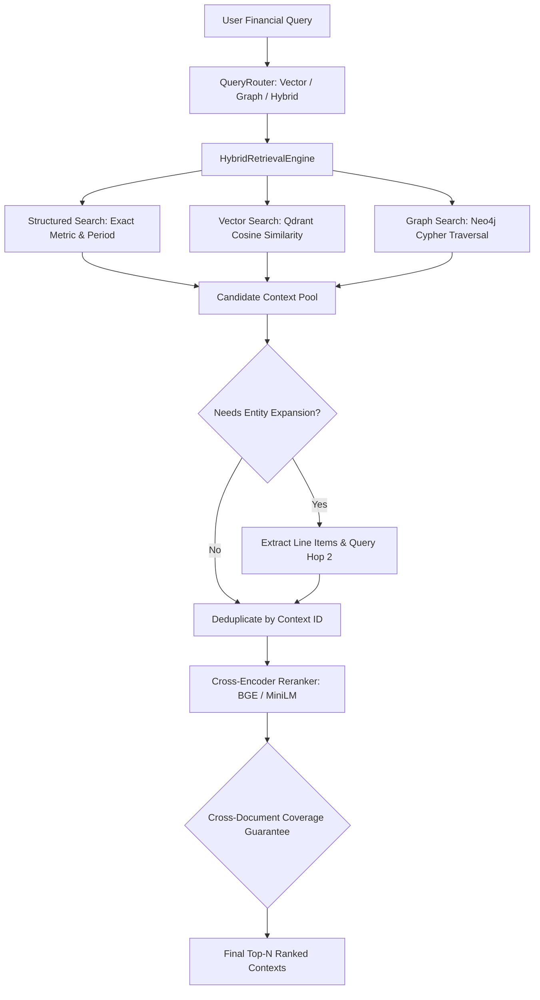

# Spec 03: Hybrid Retrieval & Cross-Encoder Reranking

## 1. Goal & Scope
Build a routed, tri-modal financial retrieval engine with 2-hop entity expansion and cross-encoder reranking:
- **Tri-Modal Retrieval Architecture**:
  1. **Structured Retrieval (`StructuredFinancialStore`)**: Exact match retrieval on normalized financial records for deterministic KPI queries and dashboard payloads.
  2. **Dense Vector Retrieval (`VectorSearcher`)**: Cosine similarity search over Qdrant vectors with store-scoped payload filtering.
  3. **Knowledge Graph Traversal (`GraphSearcher`)**: Entity-directed Cypher traversal over Neo4j to resolve relationships, structural provenance, and cross-quarter rankings.
- **Query Routing (`QueryRouter`)**:
  - Automatically route queries to `ROUTE_VECTOR`, `ROUTE_GRAPH`, or `ROUTE_HYBRID` depending on whether the query is qualitative, relational/comparative, or quantitative.
- **Store Boundary Scoping**:
  - Enforce `store_id` filtering across both Qdrant point payloads and Neo4j Cypher queries to ensure tenant isolation.
- **2-Hop Entity Expansion (`_perform_entity_expansion`)**:
  - Detect cross-document causal queries (e.g., *"Which line item grew because of marketing promotion?"*).
  - Extract causal line items from Hop 1 contexts and query connected entities in Hop 2.
- **Cross-Document Coverage Guarantee**:
  - Prevent reranker single-document bias by ensuring high-relevance Hop-2 tabular contexts (e.g., row items from spreadsheets) are not squeezed out by verbose narrative documents.
- **Cross-Encoder Reranking (`CrossEncoderReranker`)**:
  - Score query-context pairs using `BAAI/bge-reranker-base`.
  - Support pre-warmed container paths (`/app/models/bge-reranker-base`), environment overrides (`RERANKER_MODEL_PATH`), and deterministic offline fallback.

## 2. Target File Tree
- `src/retrieval/models.py`            # RetrievalQuery, RetrievedContext, HybridSearchResult schemas
- `src/retrieval/vector_search.py`     # Qdrant client vector similarity searcher
- `src/retrieval/graph_search.py`      # Neo4j Cypher traversal searcher with store scoping
- `src/retrieval/structured_search.py` # In-memory deterministic structured record store
- `src/retrieval/router.py`            # QueryRouter intent classifier and dynamic Cypher builder
- `src/retrieval/reranker.py`          # BGE Cross-Encoder scoring engine with offline fallback
- `src/retrieval/engine.py`            # HybridRetrievalEngine orchestrator class
- `tests/test_retrieval.py`            # 13-test comprehensive retrieval and reranker test suite

## 3. Data Contracts & Interfaces
Use Pydantic v2:

```python
from typing import Any, Dict, List, Optional
from pydantic import BaseModel, Field

class RetrievalQuery(BaseModel):
    query_text: str
    store_id: Optional[str] = None
    top_k_vector: int = 10
    top_k_structured: int = 10
    top_k_graph: int = 10
    final_top_n: int = 5
    filters: Optional[Dict[str, Any]] = None
    retrieval_mode: str = "auto"  # "auto", "vector", "graph", "structured", "hybrid"

class RetrievedContext(BaseModel):
    id: str
    content: str
    source_type: str  # "structured_record", "vector_chunk", "graph_subgraph", "table"
    initial_score: float = 0.0
    rerank_score: Optional[float] = None
    metadata: Dict[str, Any] = Field(default_factory=dict)

class HybridSearchResult(BaseModel):
    query: str
    ranked_contexts: List[RetrievedContext]
    total_candidates_evaluated: int
```

## 4. Retrieval Pipeline & Routing Flow



### 4.1. Entity-Directed Graph Traversal
The Neo4j searcher executes store-bounded queries matching financial line items, quarters, and relationships up to 2 hops away:
```cypher
MATCH (entity)
WHERE (entity:FinancialEntity OR entity:Metric OR entity:Quarter)
  AND (entity.store_id = $store_id OR ($store_id = 'default' AND entity.store_id IS NULL))
  AND (toLower($query_text) CONTAINS toLower(entity.name) ...)
MATCH path=(entity)-[*1..2]-(connected)
WHERE (connected.store_id = $store_id OR ($store_id = 'default' AND connected.store_id IS NULL))
UNWIND relationships(path) AS relation
WITH entity, relation, connected, length(path) AS hops
RETURN coalesce(relation.chunk_id, entity.id, toString(id(entity))) AS id,
       coalesce(relation.content, relation.value, connected.name, entity.name) AS content,
       1.0 / hops AS score,
       {entity: entity.name, connected_entity: connected.name, hops: hops,
        graph_nodes_traversed: [entity.name, connected.name],
        source_file: relation.source_file,
        numeric_value: relation.numeric_value,
        store_id: $store_id} AS metadata
ORDER BY score DESC LIMIT $limit
```

### 4.2. 2-Hop Multi-Hop Entity Expansion
When queries contain causal connectors (*"grew because"*, *"line item"*, *"driver of"*), the engine:
1. Scans Hop-1 candidate sentences for financial line items (`Marketing`, `COGS`, `Salaries`, `Beverage Sales`).
2. Dispatches secondary searches targeting the identified line items.
3. Blends Hop-2 candidates back into the candidate pool.
4. **Coverage Guarantee**: If a Hop-2 tabular context has high relevance, it is placed into the top ranked results to ensure tabular evidence is never lost.

### 4.3. Cross-Encoder Reranking
Scores candidate pairs `(query_text, context.content)`:
- Loads model with `trust_remote_code=True` and CPU device defaults.
- Checks local container path `/app/models/bge-reranker-base` before attempting network downloads.
- Falls back to a deterministic text overlap scoring function when offline or uninstalled in test environments.

## 5. Verification & Acceptance Criteria
Verified by **13 passing tests** in `tests/test_retrieval.py`:
1. `test_hybrid_engine_deduplicates_by_context_id`: Confirms deduplication of identical contexts.
2. `test_engine_uses_mock_retrieval_and_limits_results`: Confirms candidate limiting and ranking.
3. `test_engine_skips_graph_search_when_graph_expansion_is_disabled`: Confirms toggle disabling graph search.
4. `test_engine_routes_relationship_queries_to_graph`: Confirms graph traversal invocation for relationship questions.
5. `test_structured_search_returns_exact_metric_and_period`: Confirms exact structured record retrieval.
6. `test_empty_retrieval_returns_empty_result_without_reranking`: Confirms zero-candidate safety.
7. `test_cross_encoder_reranker_sorts_scores_descending`: Confirms descending score sorting.
8. `test_cross_encoder_reranker_defaults`: Confirms default model naming and instantiation.
9. `test_cross_encoder_reranker_container_model_path`: Confirms container volume path resolution.
10. `test_cross_encoder_reranker_env_overrides`: Confirms environment variable overrides.
11. `test_cross_encoder_reranker_model_instantiation_kwargs`: Confirms torch kwargs and safe loading.
12. `test_graph_search_maps_cypher_records_to_contexts`: Confirms Cypher record-to-RetrievedContext mapping.
13. `test_hybrid_engine_performs_multi_hop_entity_expansion`: Confirms causal query detection, Hop-2 expansion, and tabular coverage preservation.