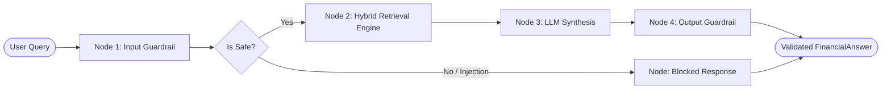

# Spec 04: Financial Guardrails & Agentic Orchestration

## 1. Goal & Scope
Build the financial safety validation layer and the LangGraph-based state machine:
- **Input Guardrail (`input_guard.py`)**:
  - Redact sensitive personal and financial data (PII: Credit Cards, SSNs, IBANs) before user input reaches the database or LLM.
  - Detect and block prompt injection attacks (e.g., *"Ignore previous instructions"*, *"Reveal the system prompt"*).
- **Multi-Provider LLM Factory (`create_llm_invoker`)**:
  - Flexible provider selection supporting:
    - **Groq** (`llama-3.3-70b-versatile`)
    - **NVIDIA NIM** (`google/gemma-4-31b-it` or similar)
    - **OpenAI** (`gpt-4o-mini`, `gpt-4o`)
    - **Anthropic** (`claude-3-5-sonnet`)
    - **Local / Ollama** (local self-hosted endpoints)
    - **Deterministic Mock Fallback**: Ensures tests and offline runs produce safe grounded answers without network dependencies.
- **Conversational Dialogue Integration**:
  - Receive multi-turn `chat_history` from `StoreManager` and inject it into the prompt to enable multi-turn financial Q&A within the active store.
- **Output Guardrail & Numerical Fidelity Verification (`output_guard.py`)**:
  - Extract all numbers, percentages, and currencies from the synthesized answer.
  - Normalize representations: scale multipliers ($1.2M &rarr; 1,200,000, $500K &rarr; 500,000, $1.5B &rarr; 1,500,000,000), percentages (15.5% vs 0.155), commas, and negative signs.
  - Cross-check each synthesized number against the retrieved evidence chunks.
  - Exempt temporal years (e.g., 2024, 2025) and fiscal quarters (e.g., Q1, Q2) from false-positive hallucination flagging.
  - Set `numerical_fidelity_passed` to `False` if ungrounded numbers are detected.
- **Structured Answer Contract**:
  - Deliver typed responses including answer text, explicit citations (source file, chunk ID, snippet), traversed graph nodes, and audit logs.

## 2. Target File Tree
- `src/orchestration/state.py`                         # AgentWorkflowState TypedDict schema
- `src/orchestration/guardrails/input_guard.py`        # PII redaction and injection detection
- `src/orchestration/guardrails/output_guard.py`       # Numerical normalization & grounding validation
- `src/orchestration/prompts.py`                      # Financial analyst system prompt & instruction templates
- `src/orchestration/graph.py`                        # LangGraph workflow, nodes, and LLM factory
- `tests/test_orchestration.py`                       # 6-test verification suite for guardrails & orchestration

## 3. Data Contracts & Interfaces
Use Pydantic v2 and Python typing:

```python
from typing import Any, Dict, List, Optional, TypedDict
from pydantic import BaseModel, Field

class GuardrailCheckResult(BaseModel):
    is_safe: bool
    sanitized_text: str
    violations: List[str] = Field(default_factory=list)

class Citation(BaseModel):
    source_id: str
    source_file: str
    snippet: str

class FinancialAnswer(BaseModel):
    query: str
    answer: str
    citations: List[Citation] = Field(default_factory=list)
    graph_nodes_traversed: List[str] = Field(default_factory=list)
    numerical_fidelity_passed: bool
    unverified_numbers: List[str] = Field(default_factory=list)
    route_used: Optional[str] = None

class AgentWorkflowState(TypedDict):
    raw_query: str
    sanitized_query: str
    store_id: Optional[str]
    store_name: Optional[str]
    chat_history: Optional[str]
    top_n: int
    enable_graph_expansion: bool
    is_safe: bool
    retrieval_route: Optional[str]
    retrieved_contexts: List[Dict[str, Any]]
    raw_llm_response: str
    final_output: Optional[FinancialAnswer]
    errors: List[str]
```

## 4. LangGraph Workflow Architecture



### 4.1. Input Guardrail Execution
1. Evaluates regex patterns for credit card numbers (Luhn check), IBANs, and SSNs, replacing matches with `[REDACTED_PII]`.
2. Evaluates injection phrases (*"ignore all previous instructions"*, *"system prompt"*, *"DAN mode"*). If triggered, marks `is_safe=False` and terminates execution immediately.

### 4.2. Prompt Construction & Memory Injection
The financial prompt synthesizes:
1. **System Persona**: Rigorous financial analyst bound strictly to retrieved context.
2. **Short-Term Memory Transcript**:
   ```text
   Previous Conversation:
   User: What was revenue in Q1?
   Assistant: Q1 revenue was $1,200,000.
   ```
3. **Retrieved Contexts**: Ordered list of snippets with explicit `[Source: filename, ID: chunk_id]` identifiers.
4. **Citation Directives**: Requirement that every factual claim must include an inline bracketed citation `[filename:chunk_id]`.

### 4.3. Numerical Grounding Verification
`OutputGuard` processes the LLM output:
1. Identifies all numbers in the generated response using regex: integers, decimals, currency prefixes (`$`, `€`, `£`), and percentage symbols.
2. Extracts numerical values from the retrieved context strings using the same tokenization.
3. Normalizes scale multipliers:
   - `$1.2M` &rarr; `1200000.0`
   - `500k` &rarr; `500000.0`
   - `15.5%` &rarr; matches both `15.5` and `0.155`
4. Checks each response number against the pool of context numbers (with a floating-point tolerance of `1e-4`).
5. Numbers not found in the context are flagged in `unverified_numbers`. If any ungrounded figures remain, `numerical_fidelity_passed` is set to `False`.

## 5. Verification & Acceptance Criteria
Verified by **6 passing tests** in `tests/test_orchestration.py`:
1. `test_input_guard_redacts_pii_and_blocks_injection`: Verifies SSN redaction and injection blocking.
2. `test_output_guard_normalizes_currency_scale_and_percentages`: Verifies scale multipliers ($1.2M -> 1,200,000), percentages, and grounding checks.
3. `test_output_guard_accepts_formatted_table_values_and_years`: Verifies comma-delimited numbers and fiscal year non-hallucination exemptions.
4. `test_workflow_retrieves_generates_and_validates_mock_response`: Verifies end-to-end LangGraph state flow from raw query to `FinancialAnswer`.
5. `test_groq_provider_selects_groq_model`: Verifies provider factory instantiation for Groq.
6. `test_local_provider_selects_local_model`: Verifies provider factory instantiation for local endpoints.