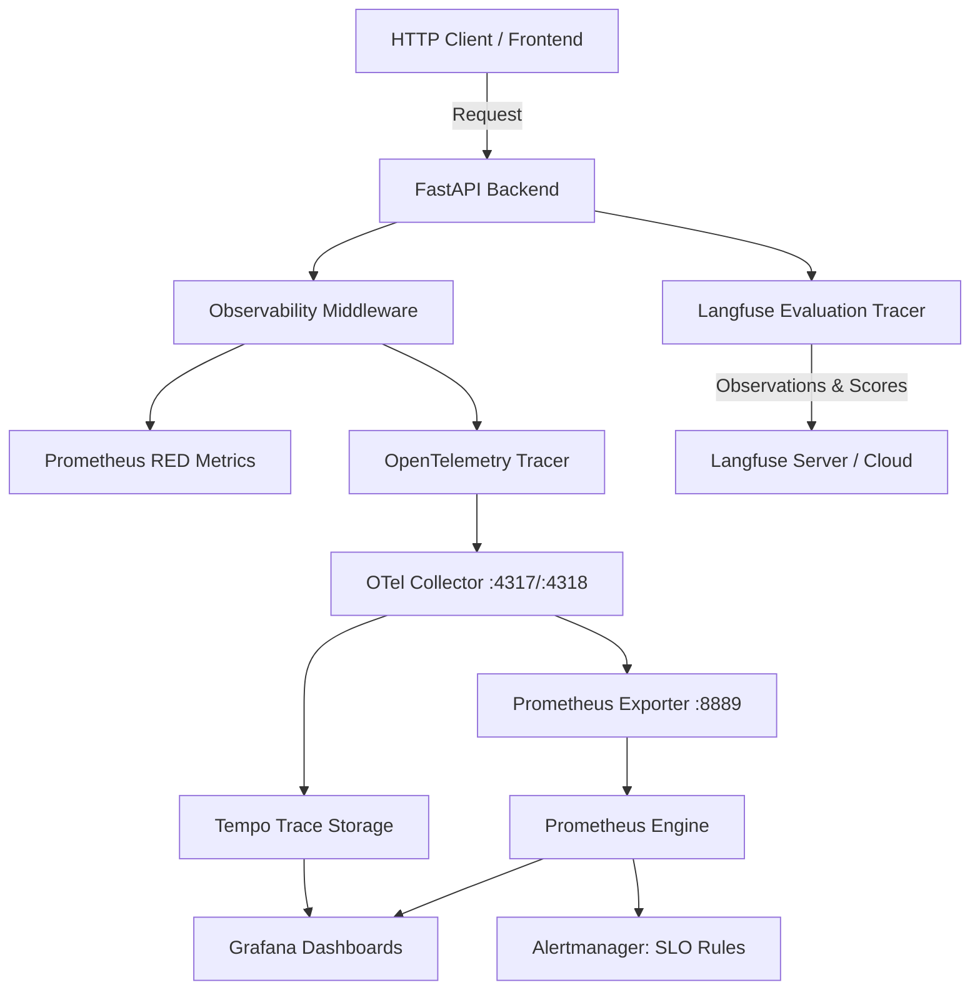

# Spec 06: Observability & Automated Evaluation Suite

## 1. Goal & Scope
Build the production telemetry, operational monitoring, and automated quality evaluation suite:
- **Distributed Tracing (OpenTelemetry)**:
  - Instrument the FastAPI application using OpenTelemetry.
  - Propagate W3C trace contexts through request pipelines.
  - Export spans via an OpenTelemetry Collector to Tempo for end-to-end trace visualization in Grafana.
- **Structured JSON Logging**:
  - Format all backend logs as JSON containing `timestamp`, `level`, `logger`, `message`, `service`, `trace_id`, and `span_id` for instant correlation with traces.
- **RED Metrics & Prometheus Exposition**:
  - Track Request Rate, Error Rate, and Duration across endpoints. Expose standard Prometheus text at `/metrics`.
- **Operational Health Probes**:
  - `/healthz/live`: Dependency-free liveness probe for Kubernetes and Docker container health.
  - `/healthz/ready`: Readiness probe verifying live connectivity to Qdrant and Neo4j.
  - `/api/health`: Public application health endpoint.
  - `/api/dashboard/data`: JSON structured financial metrics endpoint for Grafana and BI visualization.
- **SLO Baseline & Triage Alerts**:
  - Target: 99.9% availability and p95 latency below 300 ms over a rolling 30-day window.
  - Alerts configured in `observability/alerts.yml`: Page when 5xx error rate exceeds 2% for 5 minutes or p95 latency exceeds 300 ms for 10 minutes. Alert annotations contain runbook URLs and Tempo trace query filters.
- **Dual-Mode Langfuse Observability (`src/evaluation/tracer.py`)**:
  - Support modern Langfuse v3/v4 OpenTelemetry observation trees (`chain`, `guardrail`, `retriever`, `generation`, `create_score`).
  - Fall back gracefully to legacy client APIs (`trace.span(...)`) or offline execution when unconfigured.
- **Automated Quality Evaluation Harness**:
  - Execute automated benchmark evaluations against `data/eval/golden_dataset.json`.
  - Calculate quantitative metrics: Context Recall, Context Precision, Faithfulness, Numerical Hallucination Rate, and Dashboard Record Validity.

## 2. Target File Tree
- `src/observability.py`                       # OTel configuration, JSON formatter, RED metrics, health probes
- `observability/otel-collector-config.yaml`  # OTel Collector pipeline routing to Tempo & Prometheus
- `observability/prometheus.yml`               # Prometheus scrape configs and alert rule references
- `observability/alerts.yml`                   # SLO error-budget and latency alert definitions
- `observability/tempo.yaml`                    # Local Tempo trace storage configuration
- `src/evaluation/config.py`                    # EvaluationSettings (Langfuse keys, thresholds)
- `src/evaluation/tracer.py`                    # Dual-mode Langfuse tracer with observation trees
- `src/evaluation/metrics.py`                   # Faithfulness, precision, recall, and hallucination scoring
- `src/evaluation/eval_runner.py`               # Automated Golden Dataset test runner
- `data/eval/golden_dataset.json`              # Benchmark dataset of ground-truth financial Q&A pairs
- `tests/test_evaluation.py`                    # 9-test verification suite for metrics and Langfuse tracer
- `tests/test_api.py`                           # Health, readiness, and metrics endpoint test suite

## 3. Data Contracts & Interfaces
Use Pydantic v2:

```python
from typing import Any, Dict, List, Optional
from pydantic import BaseModel, Field

class GoldenTestCase(BaseModel):
    test_id: str
    query: str
    expected_answer: str
    expected_facts: List[str]
    expected_numbers: List[str]
    ground_truth_chunks: List[str]

class EvalMetricResult(BaseModel):
    metric_name: str
    score: float  # Scale 0.0 to 1.0
    details: Dict[str, Any] = Field(default_factory=dict)

class EvalRunReport(BaseModel):
    total_test_cases: int
    mean_faithfulness_score: float
    mean_numerical_accuracy: float
    results: List[Dict[str, Any]]
```

## 4. Telemetry & Evaluation Architecture



### 4.1. Langfuse Tracing Hierarchies (`src/evaluation/tracer.py`)
Each chat request creates a hierarchical observation tree:
1. `financial-rag-chat` (`as_type="chain"`): Root span recording user query, `store_id`, tags, and duration.
2. `input_guard` (`as_type="guardrail"`): Records raw query, sanitization output, and safety flags.
3. `query_routing` (`as_type="span"`): Records routed path (`VECTOR`, `GRAPH`, `HYBRID`) and routing rationale.
4. `hybrid_retrieval` (`as_type="retriever"`): Records candidates count, context snippets, and similarity scores.
5. `llm_generation` (`as_type="generation"`): Records prompt, model identifier, and raw LLM completion.
6. `output_guard_fidelity` (`as_type="guardrail"`): Records numerical grounding verification pass/fail status and unverified numbers.
7. `create_score`: Logs a `numerical_fidelity` score (`1.0` if passed, `0.0` if unverified numbers remain).

### 4.2. Automated Quality Metrics (`src/evaluation/metrics.py`)
- **Faithfulness**: Proportion of generated statements whose facts exist in both the retrieved context and the expected facts:
  $$\text{Faithfulness} = \frac{|\text{Verified Claims}|}{|\text{Total Claims}|}$$
- **Numerical Hallucination Rate**: Ratio of ungrounded numbers in the answer to total extracted numbers:
  $$\text{Hallucination Rate} = \frac{|\text{Unverified Numbers}|}{|\text{Total Synthesized Numbers}|}$$
- **Context Precision & Recall**: Alignment between retrieved context chunk IDs and ground-truth chunks.

## 5. Verification & Acceptance Criteria
Verified by **9 passing tests** in `tests/test_evaluation.py` and **7 passing tests** in `tests/test_api.py`:
1. `tests/test_evaluation.py`:
   - `test_faithfulness_requires_facts_in_answer_and_context`: Confirms fact-based grounding scoring.
   - `test_tracer_falls_back_without_credentials`: Confirms graceful startup when Langfuse keys are absent.
   - `test_tracer_workflow_run_graceful_without_client`: Confirms workflow execution when client is None.
   - `test_tracer_workflow_run_with_mock_client`: Confirms legacy client mock tracing.
   - `test_tracer_workflow_run_with_v4_observation_client`: Confirms modern v4 observation tree structure.
   - `test_eval_runner_loads_dataset_and_runs_batch`: Confirms batch execution over `golden_dataset.json`.
   - `test_runner_accepts_pydantic_final_output`: Confirms evaluation report serialization.
2. `tests/test_api.py`:
   - `test_health_route`: Confirms public `/api/health` status.
   - `test_liveness_and_metrics_routes`: Confirms `/healthz/live` and Prometheus `/metrics` exposition.