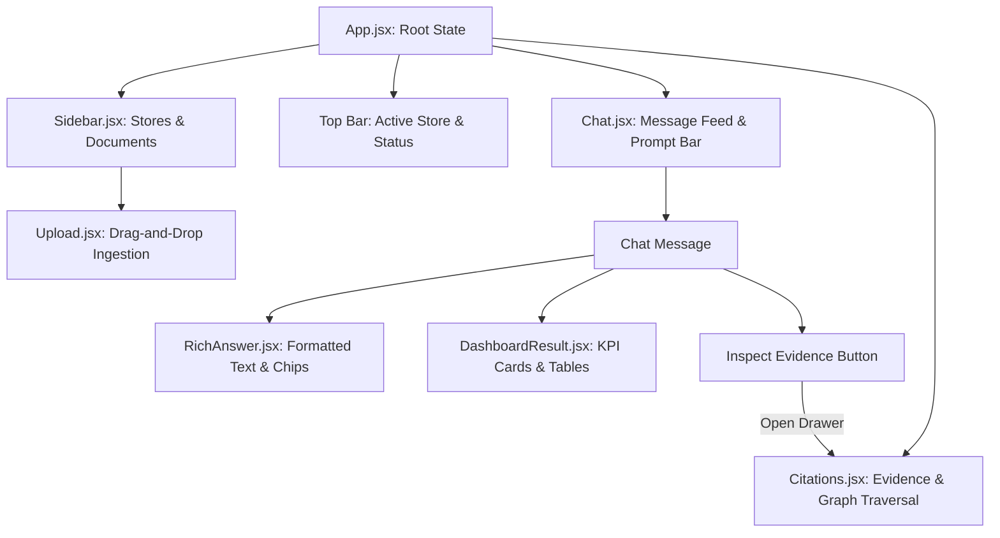

# Spec 07: React Frontend & Financial Chat Interface

## 1. Goal & Scope
Build the interactive user interface and streaming FastAPI serving layer:
- **Ledger Lens Financial Theme**:
  - Premium, responsive dark interface with high-contrast monetary badges, glassmorphic cards, and accessible typography.
- **Multi-Store Management & Navigation (`Sidebar.jsx`)**:
  - Interactive store selector for switching between financial workspaces (e.g., "Main Ledger", "Retail Branch", "EMEA Operations").
  - Store creation dialog and store deletion with cascading memory purges.
  - Store-scoped document inventory displaying filename, file type, upload timestamp, and chunk counts.
  - One-click clear-chat action per store.
- **Real-Time Streaming Chat (`Chat.jsx`)**:
  - Server-Sent Events (SSE) streaming via `/api/chat/stream` displaying tokens incrementally.
  - Handles `: keepalive` signals and status events (`processing`, `ready`).
  - Renders markdown tables, bulleted financial lists, and monetary chips using `RichAnswer.jsx`.
- **Dynamic KPI & Trend Visualizer (`DashboardResult.jsx`)**:
  - Displays KPI cards, period comparison tables, and trend visualizers for structured financial records extracted from spreadsheet tables.
- **Evidence & Citation Inspection Drawer (`Citations.jsx`)**:
  - Slide-out drawer displaying retrieved source filenames, chunk excerpts, relevance scores, and traversed Neo4j graph nodes.
- **Ad-Hoc Document Ingestion (`Upload.jsx`)**:
  - Drag-and-drop file upload supporting `.pdf`, `.xlsx`, `.csv`, `.docx`, `.txt`, `.png`, and `.jpeg`.
  - Automatically scopes uploads to the active store.
- **FastAPI Serving Layer (`src/api/server.py`)**:
  - Serves REST and streaming endpoints with CORS, OpenTelemetry middleware, and error boundaries.

## 2. Target File Tree
- `frontend/package.json`            # React dependencies and build scripts
- `frontend/vite.config.js`           # Vite build and dev server proxy settings
- `frontend/nginx.conf`               # Production Nginx reverse-proxy configuration
- `frontend/Dockerfile`               # Multi-stage container build
- `frontend/src/App.jsx`              # Root layout coordinating state and components
- `frontend/src/components/Sidebar.jsx` # Store catalog, store switching, and document listing
- `frontend/src/components/Chat.jsx`  # Streaming chat container with SSE parser
- `frontend/src/components/DashboardResult.jsx` # KPI metric cards, period comparison tables
- `frontend/src/components/RichAnswer.jsx`      # Rich markdown renderer with monetary chips
- `frontend/src/components/Citations.jsx`       # Evidence drawer for citations and graph hops
- `frontend/src/components/Upload.jsx`          # Drag-and-drop document upload widget
- `frontend/src/styles.css`           # Complete styling system
- `frontend/tests/chat.spec.js`       # Playwright end-to-end integration test
- `src/api/server.py`                 # FastAPI application and route declarations
- `src/api/schemas.py`                # Pydantic request and response schemas
- `tests/test_api.py`                 # FastAPI TestClient endpoint verification suite

## 3. Data Contracts & Interfaces
Use Pydantic v2:

```python
from typing import Any, Dict, List, Optional
from pydantic import BaseModel, Field

class ChatRequest(BaseModel):
    query: str
    top_n: int = 5
    enable_graph_expansion: bool = True
    store_id: Optional[str] = "default"

class ChatResponse(BaseModel):
    query: str
    answer: str
    citations: List[Dict[str, Any]]
    graph_nodes_traversed: List[str]
    numerical_fidelity_passed: bool
    execution_time_ms: float
    dashboard_payload: Dict[str, Any] = Field(default_factory=dict)
    route_used: Optional[str] = None
    store_id: Optional[str] = "default"

class UploadResponse(BaseModel):
    filename: str
    total_chunks: int
    chunk_types: List[str]
    store_id: Optional[str] = "default"
    doc_id: Optional[str] = None

class HealthResponse(BaseModel):
    status: str
    service: str
```

## 4. Frontend Component Hierarchy & Interaction



### 4.1. Server-Sent Events (SSE) Streaming Protocol
1. Client issues `POST /api/chat/stream` with `{"query": "...", "store_id": "..."}`.
2. Server immediately yields:
   ```text
   event: status
   data: {"status": "processing"}
   ```
3. During LLM generation, if execution takes multiple seconds, server yields keepalive pulses:
   ```text
   : keepalive
   ```
4. When answer synthesis and output guardrails complete, server yields:
   ```text
   event: token
   data: {"token": "In Q2 2025, revenue reached $1,450,000..."}

   event: complete
   data: {"query": "...", "answer": "...", "citations": [...], "numerical_fidelity_passed": true}
   ```
5. Client captures the `complete` payload, appends the assistant message, and displays citations.

### 4.2. Power BI Dashboard State (`DashboardResult.jsx`)
When structured table rows are retrieved (`source_type == "structured_record"`), `DashboardResult.jsx` parses the `dashboard_payload`:
- Renders KPI metric chips with percentage change arrows.
- Renders cross-quarter comparison tables with bold headers.
- Allows one-click JSON export formatted for Power BI REST connectors.

## 5. Verification & Acceptance Criteria
1. **Automated API Tests (`tests/test_api.py`)**:
   - `test_upload_route_parses_csv`: Confirms multipart upload returns chunks and types.
   - `test_chat_route_returns_response_contract`: Confirms full ChatResponse structure.
   - `test_chat_route_applies_retrieval_controls`: Confirms passing `top_n` and `enable_graph_expansion`.
   - `test_chat_stream_route_returns_token_and_complete_events`: Confirms SSE event stream protocol.
   - `test_chat_route_blocks_prompt_injection`: Confirms safety rejection response.
2. **Playwright E2E Test (`frontend/tests/chat.spec.js`)**:
   - Uploads `data/samples/sample_pnl.csv`.
   - Waits for document indexing confirmation badge.
   - Asks *"What was revenue in Q2 2025?"*.
   - Verifies rendering of the `$1,450,000` trend row in `DashboardResult`.
   - Opens the evidence drawer and verifies `sample_pnl.csv` citation visibility.