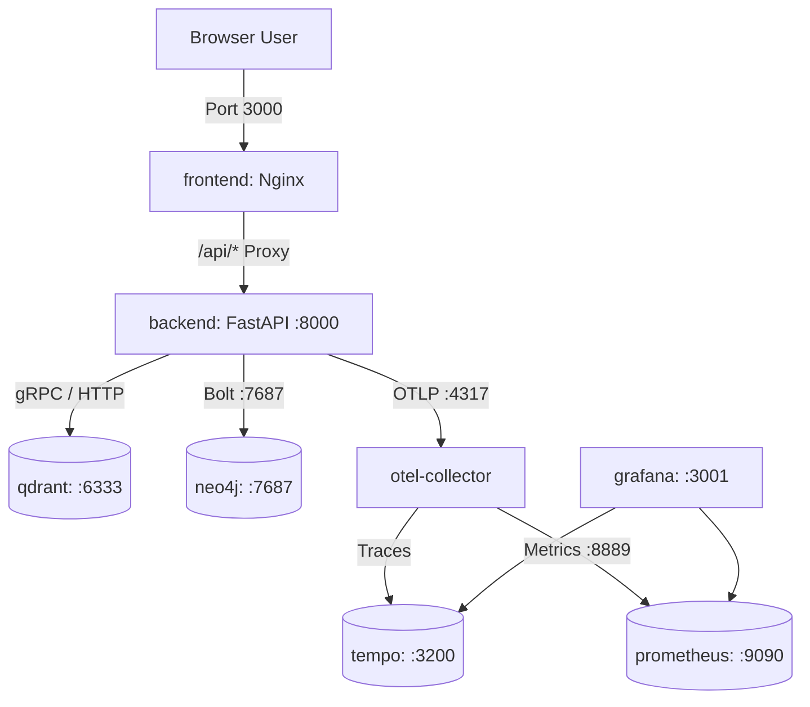

# Spec 08: Production Containerization & CI/CD Pipeline

## 1. Goal & Scope
Package the multi-service system for reproducible, isolated deployment and establish automated CI/CD quality gates:
- **Multi-Service Container Orchestration (`docker-compose.yml`)**:
  - Coordinate 8 interoperating production services:
    1. `backend`: FastAPI application with Tesseract OCR runtime and cached models.
    2. `frontend`: React Single Page Application served via Nginx with reverse proxy to backend.
    3. `qdrant`: High-performance vector database with persistence.
    4. `neo4j`: Property graph database with APOC plugins and persistence.
    5. `otel-collector`: OpenTelemetry Collector receiving OTLP traces and metrics.
    6. `prometheus`: Timeseries database evaluating SLO alerts.
    7. `tempo`: High-volume distributed trace storage.
    8. `grafana`: Operational monitoring and telemetry visualization dashboards.
- **Production Dockerfiles**:
  - `Dockerfile` (Backend): Multi-stage Python 3.11-slim container with Tesseract OCR OS libraries, pre-warmed HuggingFace model cache, and non-root execution (`appuser`).
  - `frontend/Dockerfile`: Multi-stage build (`node:20-alpine` build -> `nginx:alpine` static serving with `/api/` reverse proxy).
- **Automated CI/CD Pipeline (`.github/workflows/ci.yml`)**:
  - Run linting (`ruff`), static typing, full 60-test pytest suite, and container build checks on every pull request to `main`.
- **Health Checks & Startup Sequencing**:
  - Explicit health checks enforce proper dependency startup order: `neo4j` (via `cypher-shell`), `qdrant` (via `/readyz`), and `backend` (via `/healthz/live` and `/healthz/ready`).

## 2. Target File Tree
- `Dockerfile`                     # Multi-stage container build for FastAPI backend
- `frontend/Dockerfile`            # Multi-stage build for React frontend (Vite build + Nginx)
- `frontend/nginx.conf`            # Nginx proxy configuration routing /api to backend
- `docker-compose.yml`             # Full 8-service stack orchestrator
- `.dockerignore`                  # Prevents virtualenvs, node_modules, and cache files in build context
- `.github/workflows/ci.yml`       # Automated GitHub Actions test, lint, and build pipeline
- `scripts/healthcheck.sh`         # Verification script to validate running container endpoints
- `observability/*`                # Telemetry configs (otel-collector, prometheus, tempo, alerts)

## 3. Configuration Specifications

### 3.1. Docker Services Architecture


| Service | Image / Build | Ports | Healthcheck & Dependencies |
|---|---|---|---|
| `backend` | `./Dockerfile` | `8000:8000` | Dep on `neo4j` (healthy), `qdrant` (healthy), `otel-collector` |
| `frontend` | `./frontend/Dockerfile` | `3000:80` | Dep on `backend` (healthy) |
| `qdrant` | `qdrant/qdrant:latest` | `6333:6333` | Healthcheck: `/readyz` endpoint |
| `neo4j` | `neo4j:5.20.0` | `7474:7474`, `7687:7687` | Healthcheck: `cypher-shell "RETURN 1"` |
| `otel-collector` | `otel/opentelemetry-collector-contrib` | `4317`, `4318`, `8889` | Receives gRPC/HTTP OTLP |
| `prometheus` | `prom/prometheus:latest` | `9090:9090` | Scrapes collector; evaluates `observability/alerts.yml` |
| `tempo` | `grafana/tempo:latest` | `3200:3200` | Local trace block storage |
| `grafana` | `grafana/grafana:latest` | `3001:3000` | Datasources pre-provisioned for Prometheus & Tempo |

### 3.2. Root Dockerfile Specifications
```dockerfile
FROM python:3.11-slim AS runtime

# Install system dependencies including Tesseract OCR
RUN apt-get update && apt-get install -y --no-install-recommends \
    tesseract-ocr \
    tesseract-ocr-eng \
    libtesseract-dev \
    curl \
    && rm -rf /var/lib/apt/lists/*

WORKDIR /app

# Install wheels
COPY requirements.txt .
RUN pip install --no-cache-dir -r requirements.txt

# Create non-root app user
RUN useradd -m -u 1000 appuser && chown -R appuser:appuser /app
USER appuser

COPY --chown=appuser:appuser . .

EXPOSE 8000
CMD ["uvicorn", "src.api.server:app", "--host", "0.0.0.0", "--port", "8000"]
```

### 3.3. Frontend Dockerfile Specifications
```dockerfile
# Stage 1: Build static bundle
FROM node:20-alpine AS build
WORKDIR /app
COPY package*.json ./
RUN npm ci
COPY . .
RUN npm run build

# Stage 2: Serve via Nginx
FROM nginx:alpine
COPY --from=build /app/dist /usr/share/nginx/html
COPY nginx.conf /etc/nginx/conf.d/default.conf
EXPOSE 80
CMD ["nginx", "-g", "daemon off;"]
```

### 3.4. GitHub Actions CI Pipeline (`.github/workflows/ci.yml`)
- **Triggers**: `push` to `main`, `pull_request` against `main`.
- **Jobs**:
  1. `lint-and-test`:
     - Python 3.11 environment.
     - Cache pip dependencies.
     - Install requirements (`pip install -r requirements.txt`).
     - Lint with `ruff check .`.
     - Execute the full automated test suite: `pytest -v` (verifying all 60 tests).
  2. `build-check`:
     - Builds Docker containers via `docker compose build` to verify clean build stages without pushing images.

## 4. Verification & Acceptance Criteria
1. `docker compose config` evaluates without structural or syntax errors.
2. `pytest` executes and passes all 60 tests across the repository.
3. `scripts/healthcheck.sh` successfully verifies HTTP 200 responses from `/api/health`, `/healthz/live`, `/healthz/ready`, and `/metrics`.