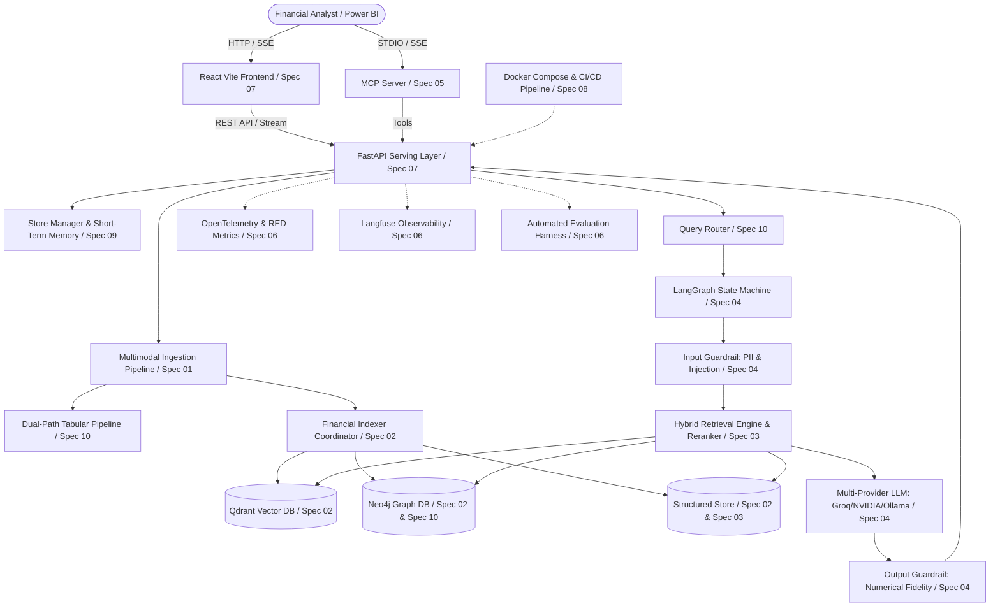

# Production-Level Financial RAG: System Specifications

## 1. System Overview & Architecture

The **Production-Level Financial RAG System** is an enterprise-grade financial intelligence engine designed to ingest, normalize, index, and query complex financial reports (spreadsheets, annual reports, earnings call transcripts, scanned receipts, Word memos).

It employs a **tri-modal architecture**:
1. **Dense Vector Search (Qdrant)**: Semantic retrieval over structured table rows and narrative paragraphs.
2. **Knowledge Graph Traversal (Neo4j)**: Property graph linking stores, documents, metrics, line items, and temporal periods for multi-hop reasoning.
3. **Structured Financial Records (`StructuredFinancialStore`)**: Deterministic key-value metrics for exact KPI lookups and Power BI dashboard feeds.

Orchestrated through **LangGraph** with strict input/output guardrails, the system guarantees numerical grounding, multi-store tenant isolation, short-term conversational memory, distributed OpenTelemetry tracing, and automated quality benchmarking.



---

## 2. Master Specification Index

| Spec | Title | Primary Components | Verification Suite |
|---|---|---|---|
| [Spec 01](file:///c:/Users/VigneshPandurangGaun/OneDrive%20-%20McLaren%20Strategic%20Solutions%20US%20Inc/Documents/Final%20Evaluation%20Project/Production%20level%20RAG/specs/01-document-ingestion-multimodal.md) | **Multimodal Financial Document Ingestion** | PDF, Excel, CSV, Word (`.docx`), TXT, Tesseract OCR (`.png`/`.jpg`), Pydantic models | `tests/test_ingestion.py` (8 tests) |
| [Spec 02](file:///c:/Users/VigneshPandurangGaun/OneDrive%20-%20McLaren%20Strategic%20Solutions%20US%20Inc/Documents/Final%20Evaluation%20Project/Production%20level%20RAG/specs/02-graph-vector-storage-indexing.md) | **Hybrid Graph & Vector Storage Engine** | Qdrant vector indexing, Neo4j graph extraction, store-scoped payloads, startup sync | `tests/test_indexing.py` (5 tests) |
| [Spec 03](file:///c:/Users/VigneshPandurangGaun/OneDrive%20-%20McLaren%20Strategic%20Solutions%20US%20Inc/Documents/Final%20Evaluation%20Project/Production%20level%20RAG/specs/03-hybrid-retrieval-reranking.md) | **Hybrid Retrieval & Cross-Encoder Reranking** | Tri-modal search, 2-hop entity expansion, cross-document coverage, BGE cross-encoder | `tests/test_retrieval.py` (13 tests) |
| [Spec 04](file:///c:/Users/VigneshPandurangGaun/OneDrive%20-%20McLaren%20Strategic%20Solutions%20US%20Inc/Documents/Final%20Evaluation%20Project/Production%20level%20RAG/specs/04-guardrails-and-agentic-orchestration.md) | **Financial Guardrails & Agentic Orchestration** | LangGraph workflow, PII & injection guard, numerical fidelity guard, multi-provider LLM | `tests/test_orchestration.py` (6 tests) |
| [Spec 05](file:///c:/Users/VigneshPandurangGaun/OneDrive%20-%20McLaren%20Strategic%20Solutions%20US%20Inc/Documents/Final%20Evaluation%20Project/Production%20level%20RAG/specs/05-mcp-server-and-tooling.md) | **Model Context Protocol (MCP) Server & Tooling** | FastMCP server, financial search, EBITDA & CAGR math, graph inspection, Power BI payload | `tests/test_mcp.py` (8 tests) |
| [Spec 06](file:///c:/Users/VigneshPandurangGaun/OneDrive%20-%20McLaren%20Strategic%20Solutions%20US%20Inc/Documents/Final%20Evaluation%20Project/Production%20level%20RAG/specs/06-evaluation-and-observability.md) | **Observability & Automated Evaluation Suite** | OpenTelemetry, Prometheus, Tempo, Grafana, Langfuse v4 traces, Golden dataset eval | `tests/test_evaluation.py` (9 tests)<br>`tests/test_api.py` (7 tests) |
| [Spec 07](file:///c:/Users/VigneshPandurangGaun/OneDrive%20-%20McLaren%20Strategic%20Solutions%20US%20Inc/Documents/Final%20Evaluation%20Project/Production%20level%20RAG/specs/07-react-frontend-interface.md) | **React Frontend & Financial Chat Interface** | Vite React app, multi-store sidebar, SSE streaming chat, dashboard cards, citations | `tests/test_api.py` (7 tests)<br>`frontend/tests/chat.spec.js` |
| [Spec 08](file:///c:/Users/VigneshPandurangGaun/OneDrive%20-%20McLaren%20Strategic%20Solutions%20US%20Inc/Documents/Final%20Evaluation%20Project/Production%20level%20RAG/specs/08-cicd-docker-deployment.md) | **Production Containerization & CI/CD Pipeline** | Multi-stage Dockerfiles, Docker Compose (8 services), GitHub Actions CI/CD | `docker compose config`<br>GitHub Actions CI |
| [Spec 09](file:///c:/Users/VigneshPandurangGaun/OneDrive%20-%20McLaren%20Strategic%20Solutions%20US%20Inc/Documents/Final%20Evaluation%20Project/Production%20level%20RAG/specs/09-multi-store-isolation-and-memory.md) | **Multi-Store Isolation & Conversational Short-Term Memory** | `StoreManager`, store registry, document tracking, multi-turn history windowing | `tests/test_store_rag.py` (4 tests) |
| [Spec 10](file:///c:/Users/VigneshPandurangGaun/OneDrive%20-%20McLaren%20Strategic%20Solutions%20US%20Inc/Documents/Final%20Evaluation%20Project/Production%20level%20RAG/specs/10-intelligent-routing-and-graph-blueprint.md) | **Intelligent Query Routing & Tabular Cypher Blueprinting** | `QueryRouter` (Vector/Graph/Hybrid), dynamic Cypher generation, dual-path tabular pipeline | `tests/test_store_rag.py`<br>`tests/test_retrieval.py` |

---

## 3. Test Verification Matrix (60 Automated Tests)

The entire system is continuously verified by an automated test suite of **60 passing tests**:

```text
======================= 60 passed in 24.24s =======================
tests/test_api.py (7 passed)
tests/test_evaluation.py (9 passed)
tests/test_indexing.py (5 passed)
tests/test_ingestion.py (8 passed)
tests/test_mcp.py (8 passed)
tests/test_orchestration.py (6 passed)
tests/test_retrieval.py (13 passed)
tests/test_store_rag.py (4 passed)
```

| Test Module | Tests | Specifications Covered | Key Capabilities Verified |
|---|---|---|---|
| `tests/test_ingestion.py` | 8 | Spec 01, Spec 10 | CSV tables, multi-sheet Excel, `.docx` paragraphs, `.txt` chunks, Tesseract OCR text, unsupported extensions, PDF table markdown |
| `tests/test_indexing.py` | 5 | Spec 02, Spec 09, Spec 10 | Qdrant in-memory upsert/search, graph metric & quarter extraction, Neo4j mocked driver, indexer coordinator, document registration & unstructured linking |
| `tests/test_retrieval.py` | 13 | Spec 03, Spec 10 | Context deduplication, top-k limits, graph expansion toggle, relationship query routing, structured store exact matches, empty query safety, BGE cross-encoder reranker sorting/defaults/container caching/env overrides, Neo4j record mapping, 2-hop entity expansion |
| `tests/test_orchestration.py` | 6 | Spec 04, Spec 09 | PII redaction, prompt injection blocking, numerical scale multiplier ($1.2M -> 1.2M), percentage scaling (15.5% vs 0.155), fiscal year recognition, end-to-end LangGraph state flow, Groq & local provider factories |
| `tests/test_mcp.py` | 8 | Spec 05 | Growth rate math, zero-denominator rejection, EBITDA margin calculation, financial search bridge serialization, dashboard structured records filtering, parameterized graph inspection, MCP tool signatures |
| `tests/test_evaluation.py` | 9 | Spec 06 | Fact-grounded faithfulness, Langfuse credential fallback, workflow run without client, mock client tracing, modern v4 observation client tracing, Golden dataset batch evaluation, Pydantic runner compatibility |
| `tests/test_api.py` | 7 | Spec 06, Spec 07, Spec 09 | Public `/api/health`, `/healthz/live`, `/metrics` scrape, CSV `/api/upload`, `/api/chat` response contract, retrieval parameter passing, SSE `/api/chat/stream` token & completion events, prompt injection rejection |
| `tests/test_store_rag.py` | 4 | Spec 09, Spec 10 | Store creation & listing, store-scoped upload & document inventory, short-term conversational memory & clear-chat, QueryRouter classification & dynamic Cypher generation |

---

## 4. End-to-End Operational Lifecycle

1. **Upload & Ingestion**:
   - Analyst selects or creates a Store (`store_id`) in the frontend sidebar.
   - Uploads financial file via `/api/upload` (multipart form).
   - Ingestion pipeline routes file to parser:
     - Excel/CSV: Dual-path header-injected rows + schema blueprint extraction.
     - PDF: `pdfplumber` extracts tables as Markdown and narrative paragraphs as text.
     - Word/TXT: Paragraph parsing.
     - PNG/JPG: Tesseract OCR extracts receipt items; metadata retained as fallback.
   - Chunks and structured records are created with `store_id` and `doc_id`.
2. **Indexing & Storage**:
   - Dense vectors embedded and upserted to Qdrant collection with `store_id` payload.
   - Structured records added to `StructuredFinancialStore`.
   - Graph entities and relationships merged into Neo4j property graph scoped to `(:Store {id: store_id})`.
3. **Query & Routing**:
   - Analyst sends a financial question (via `/api/chat` or `/api/chat/stream`).
   - `StoreManager` retrieves the last 6 conversation turns for that store.
   - `QueryRouter` classifies query into `ROUTE_VECTOR`, `ROUTE_GRAPH`, or `ROUTE_HYBRID`.
4. **Execution & Guardrails**:
   - **Input Guard**: Inspects query for PII (redacts) and prompt injections (blocks).
   - **Hybrid Retrieval**: Queries Qdrant (filtered by `store_id`), Neo4j (via Cypher or traversal), and Structured Store. Performs 2-hop entity expansion for causal queries ("grew because", "line item") and reranks with `bge-reranker-base`.
   - **LLM Generation**: Synthesizes answer using grounded contexts and short-term dialogue memory.
   - **Output Guard**: Extracts all numbers and percentages from the response, normalizes scales ($1.2M -> 1,200,000), and validates each against retrieved evidence to eliminate numerical hallucinations.
5. **Delivery & Observability**:
   - Answer, citations, traversed graph nodes, and Power BI-ready dashboard payload are returned or streamed via SSE.
   - Dialogue turn is recorded in `StoreManager`.
   - OpenTelemetry span exported to Tempo; RED metrics recorded in Prometheus; trace hierarchy logged to Langfuse.
